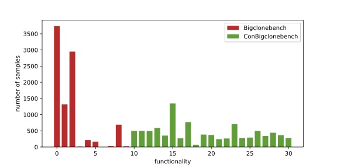
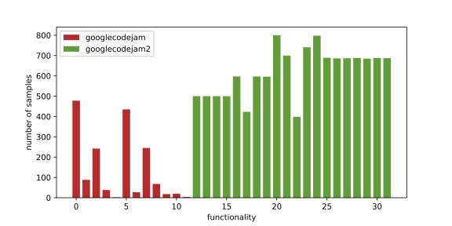

# Multi-Perspective Evaluation for Code Clone Detection
This is the source code and dataset for multi-perspective evaluation for code clone detection

## Repo Structure
- dataset: save the source code of the two dataset
  - cbcb: ConBigCloneBench
    - code0 ~ code3: codes after code abstract described in the paper
    - functions_noerr.csv: function information in cbcb
    - cbcb.json: new startine and endline number after analyzed with call graph, which one function sample may become a multi function sample with more than one start-end line number 
  - gcj:  GoogleCodeJam2
    - code0 ~ code3 similar to cbcb
    - gcj.csv: origin data gathered from internet 
  - train_split: split the data into train test eval from different perspective described in the paper
- ASTNN: astnn model
- TBCCD: tbccd model
- FAAST: faast model
- Linear model: linear model
- dataset_source_code

## SOTA models
- ASTNN：a rnn model based on ast and its subtrees
- TBCCD：a cnn model based on ast with well-designed token embedding named PACE
- FAAST：a gnn model based on ast which argumented by control flow and data flow
- Linear model： a sample linear model based on bag-of-words

## Dataset Description
ConBigCloneBench(we call it cbcb here) and googlecodejam2(we cal it gcj here)
download the dataset from (https://drive.google.com/file/d/1lPYBrll1uWxDcB5MZ308kDPfV4gVGc_Z/view?usp=sharing) and unzip it into folder 'dataset/'

## Run Experiment
### Args
- dataset: cbcb | gcj, choose a dataset
- split: random0 | pro0 | fun0 | all0, choose a evaluation perspective
- cross: 0 | 1 | 2 | 3, choose a code abstract level
- cuda: cuda device
### Command
for every model, you can use command like `python train.py --dataset gcj --split random0 --cross 1 --cuda 0` to train a model in specified evaluation perspective
### Dependency
the run enviroment for every model is different, you can use `conda env` or `virtual env`to organize the enviroments, the detail enviroment is as follow:
##### ASTNN
pytorch == 1.9.0 + cuda10.2
javalang == 0.13.0
pandas == 1.3.5
numpy == 1.21.5
scikit-learn == 1.0.2
##### FAAST
pytorch == 1.9.0 + cuda10.2
javalang == 0.13.0
numpy == 1.21.5
torch-geometric == 2.0.3
anytree == 2.8.0
##### TBCCD
javalang == 0.13.0
numpy == 1.21.5
gensim == 3.5.0
tensorflow-gpu == 1.15.0
##### Linear Model
pytorch == 1.9.0 + cuda10.2
javalang == 0.13.0
numpy == 1.21.5
scikit-learn == 1.0.2
gensim == 3.5.0
